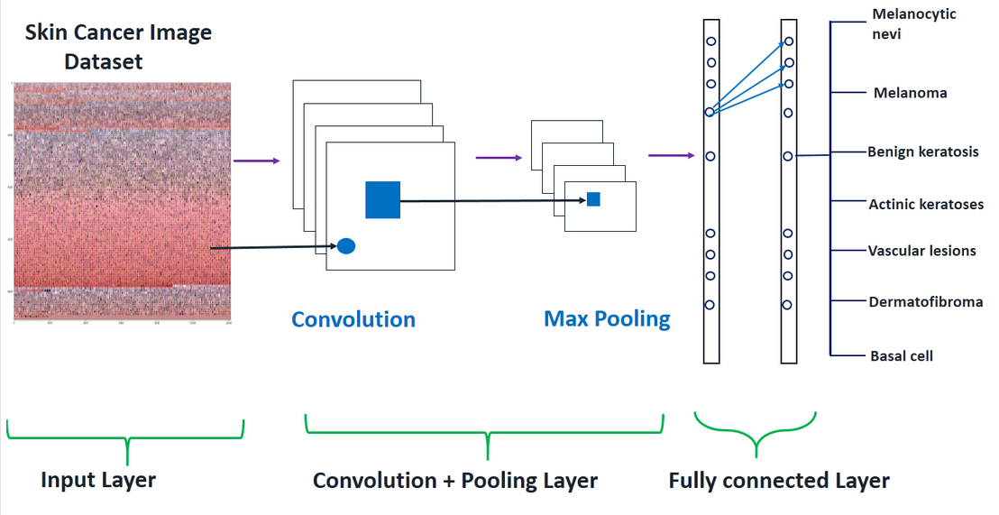
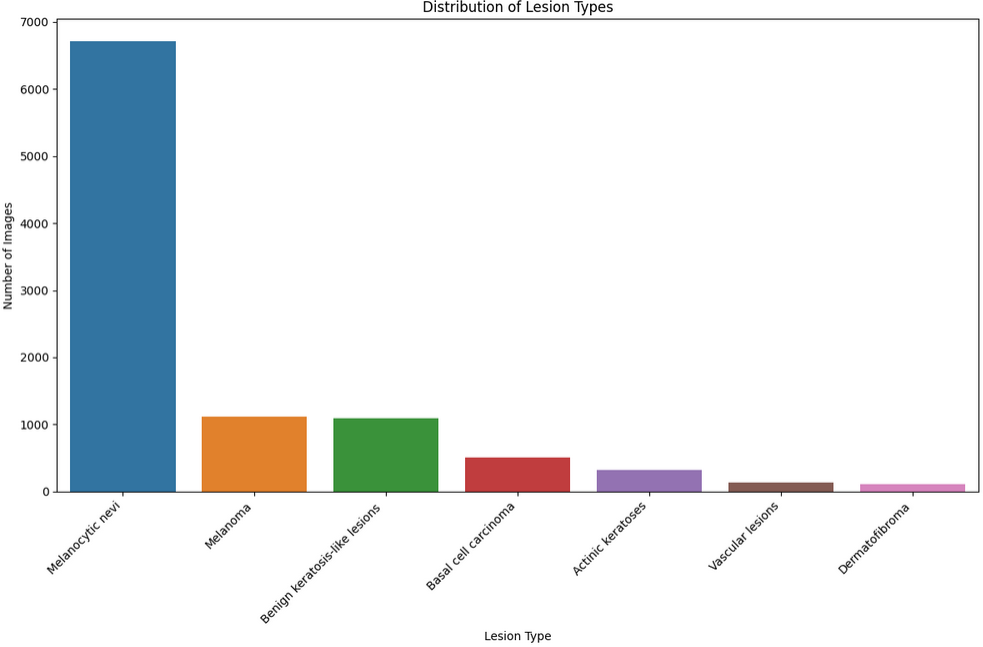
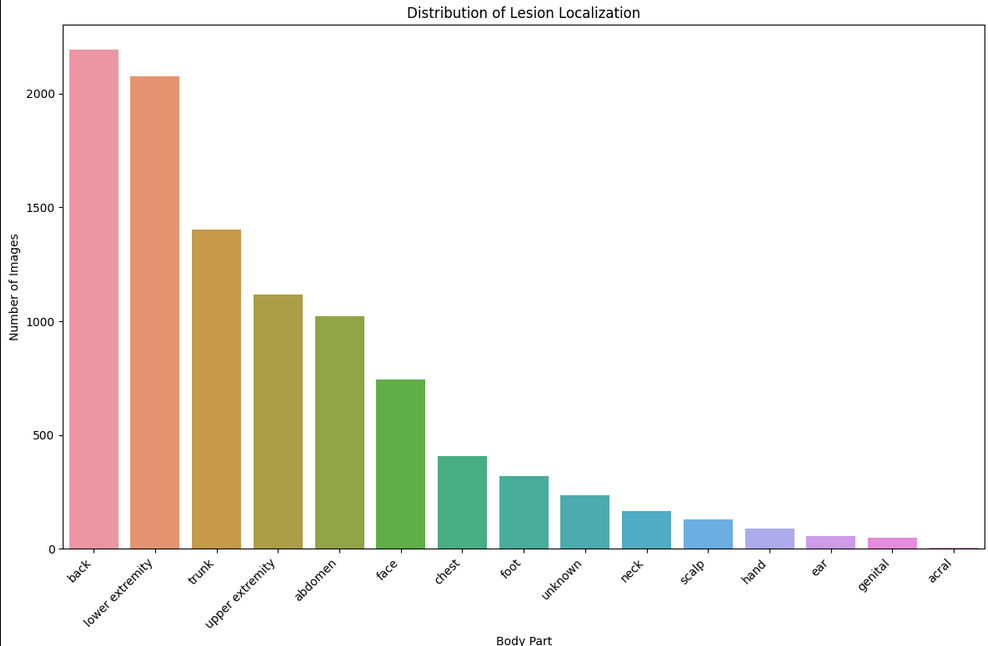
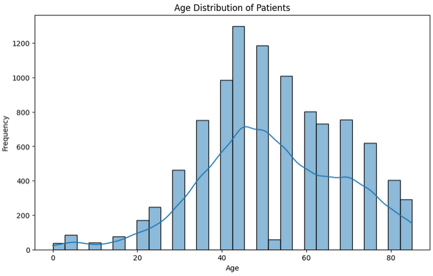
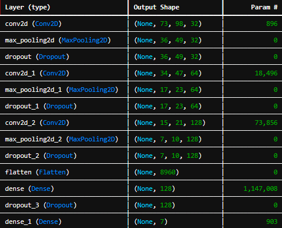
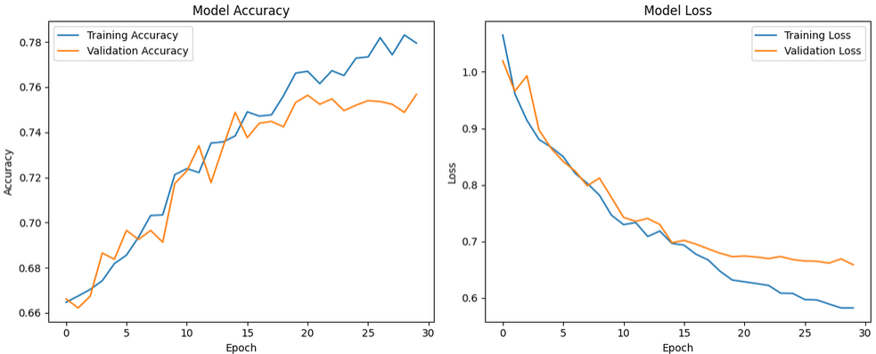
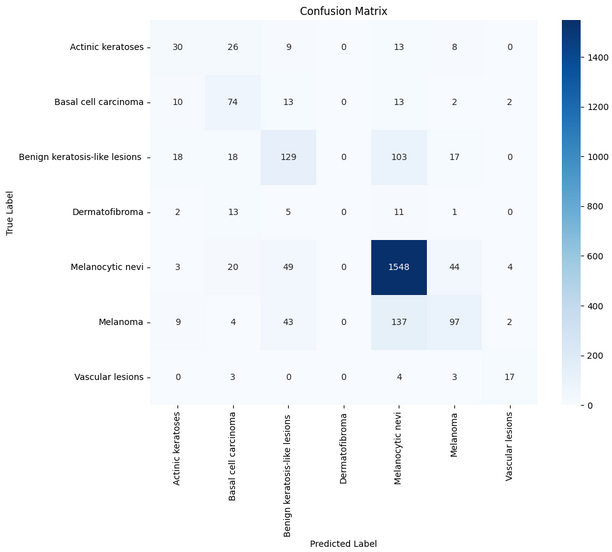
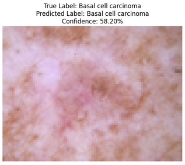

# CNN for Skin Cancer Detection 🩺

This project focuses on building a **Convolutional Neural Network (CNN)** to classify different types of skin cancer lesions from dermatoscopic images. The model aims to distinguish between 7 different classes of skin lesions, leveraging the power of deep learning to aid in visual diagnosis.

## Overview 📝

Skin cancer is the most common form of human malignancy. Its diagnosis is primarily visual, starting with a clinical screening and potentially followed by dermoscopic analysis and biopsy. Automating the classification of skin lesions is a challenging task due to the subtle, fine-grained variations in their appearance.

This project uses the **HAM10000 ("Human Against Machine with 10000 training images")** dataset to train a CNN model capable of classifying skin lesions into seven distinct categories.

---

## The Dataset: HAM10000 🖼️

The HAM10000 dataset is a collection of **10,015 dermatoscopic images** made available for machine learning research through the ISIC archive. It's a benchmark dataset designed for comparing machine learning models against human expert performance.

The dataset is categorized into 7 classes of skin cancer:
1.  **Melanocytic nevi** (nv)
2.  **Melanoma** (mel)
3.  **Benign keratosis-like lesions** (bkl)
4.  **Basal cell carcinoma** (bcc)
5.  **Actinic keratoses** (akiec)
6.  **Vascular lesions** (vasc)
7.  **Dermatofibroma** (df)

   

``

---

## Dataset Link 💾

The dataset used for this project is the **HAM10000 ("Human Against Machine with 10000 training images")** dataset, which is publicly available on Kaggle.

* **Dataset:** [Skin Cancer MNIST: HAM10000](https://www.kaggle.com/datasets/kmader/skin-cancer-mnist-ham10000)

## Methodology ⚙️

I've followed a systematic 14-step process to build, train, and evaluate the skin cancer detection model.

**Step 1: Importing Essential Libraries**
* Loading key libraries like TensorFlow, Keras, Pandas, and Scikit-learn.

**Step 2: Making a Dictionary of Images and Labels**
* Mapping image IDs to their respective lesion type labels.

**Step 3: Reading and Processing Data**
* Loading the metadata and preparing it for analysis.

**Step 4: Data Cleaning**
* Handling any missing or null values in the dataset.

**Step 5: Exploratory Data Analysis (EDA)**
* Visualizing the data distribution across different classes and features like age, sex, and lesion location.

``
``

**Step 6: Loading & Resizing Images**
* Loading all images from their directories and resizing them to a uniform dimension (e.g., 100x75) suitable for the CNN.

**Step 7: Train-Test Split**
* Splitting the dataset into training and testing sets to evaluate model performance on unseen data.

**Step 8: Normalization**
* Scaling pixel values from the range [0, 255] to [0, 1] to help the model converge faster.

**Step 9: Label Encoding**
* Converting categorical string labels (e.g., 'mel', 'nv') into numerical format.

**Step 10: Train-Validation Split**
* Further splitting the training data into training and validation sets to monitor for overfitting during training.

**Step 11: Model Building (CNN)**
* Defining the architecture of the Convolutional Neural Network, including convolutional layers, pooling layers, and dense layers.

**Step 12: Setting Optimizer & Annealing**
* Choosing an optimizer (e.g., Adam) and setting up a learning rate reduction schedule (`ReduceLROnPlateau`) to adjust the learning rate based on validation accuracy.

**Step 13: Fitting the Model**
* Training the CNN on the training data for a specified number of epochs.

**Step 14: Model Evaluation**
* Assessing the model's performance using metrics like accuracy, loss, and a confusion matrix.

---

## Results & Evaluation 📊

This section showcases the performance of the trained model on the test dataset.

``
``

### Confusion Matrix

The confusion matrix provides a detailed look at the model's classification performance for each of the 7 classes.

``

### Final Accuracy

* **Test Accuracy:** `75.68%`

---

## Technologies Used 💻

* **Programming Language:** Python
* **Libraries:** TensorFlow, Keras, Scikit-learn, Pandas, NumPy, Matplotlib, Seaborn

## Future Plans 🚀

While the current model provides a solid foundation, there are several exciting avenues for future development to enhance its accuracy, usability, and real-world impact.

### Mobile Application Development

* **Build a Cross-Platform App:** Develop a mobile application for both iOS and Android. This app would allow users to either upload an image from their gallery or use their phone's camera to capture a new image of a skin lesion and receive a classification result in real-time.
* **User-Friendly Interface (UI/UX):** Design an intuitive interface that guides the user on how to take high-quality, well-lit photos, as image quality is crucial for accurate predictions. The app would provide instant feedback and a probability score for each lesion type.

### Model Enhancement & Performance

* **Transfer Learning:** Implement more advanced, pre-trained architectures like **ResNet50, VGG16, or EfficientNet**. These models have been trained on millions of diverse images (ImageNet dataset) and can act as powerful feature extractors, which could significantly boost classification accuracy.
* **Advanced Data Augmentation:** Expand on data augmentation techniques to create a more robust model. This includes applying more transformations like shearing, elastic distortions, and brightness adjustments to simulate a wider range of real-world image conditions.
* **Hyperparameter Tuning:** Use automated tools like KerasTuner or Optuna to systematically search for the optimal combination of hyperparameters (e.g., learning rate, number of layers, filter sizes, dropout rates) to squeeze out the best possible performance.

### Advanced Features & Usability

* **API and Cloud Deployment:** Deploy the final trained model on a cloud service (like AWS, Google Cloud, or Azure) and serve it through a REST API. This would make the model scalable, reliable, and accessible for both the mobile app and potentially other third-party integrations.
